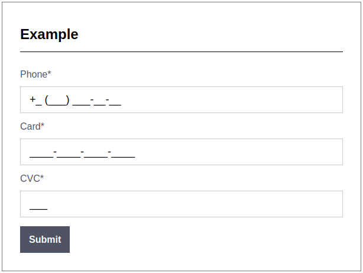

[NumberMask](https://keygenqt.com/work/js-numbermask)
===================


jQuery plugin for mask desktop browsers input

## Usage

```js
// phone
$('#id1').numbermask({
    mask: "+# (###) ###-##-##"
});

// card
$('#id2').numbermask({
    mask: "####-####-####-####"
});

// cvc
$('#id3').numbermask({
    mask: "####"
});
```

### Preview


